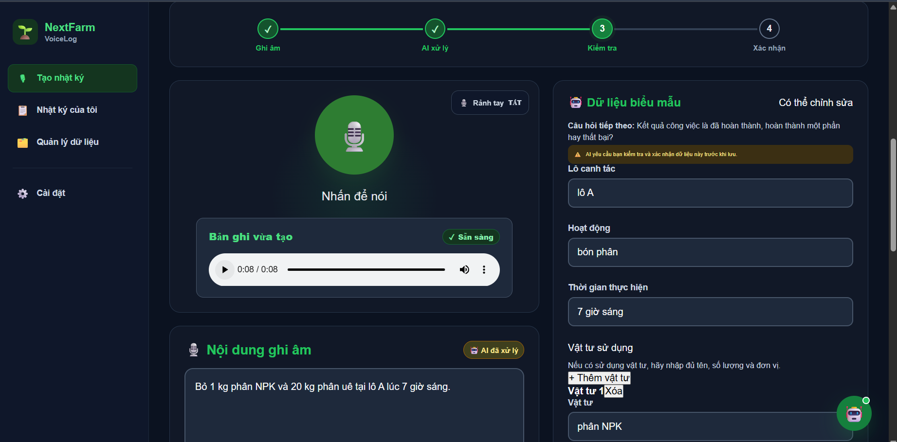
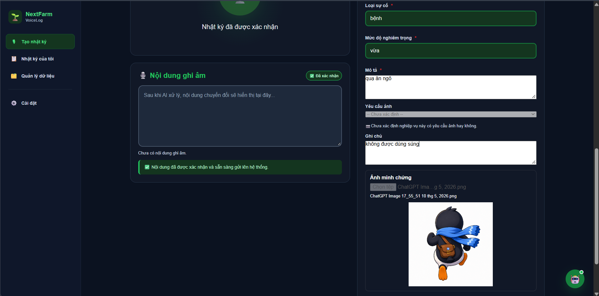
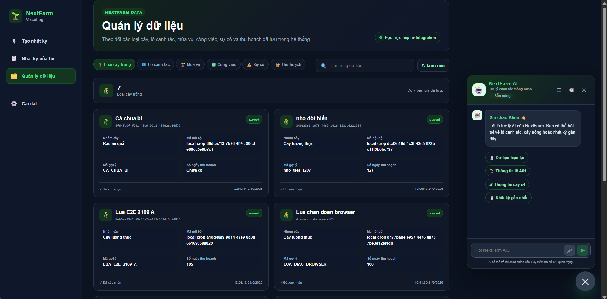
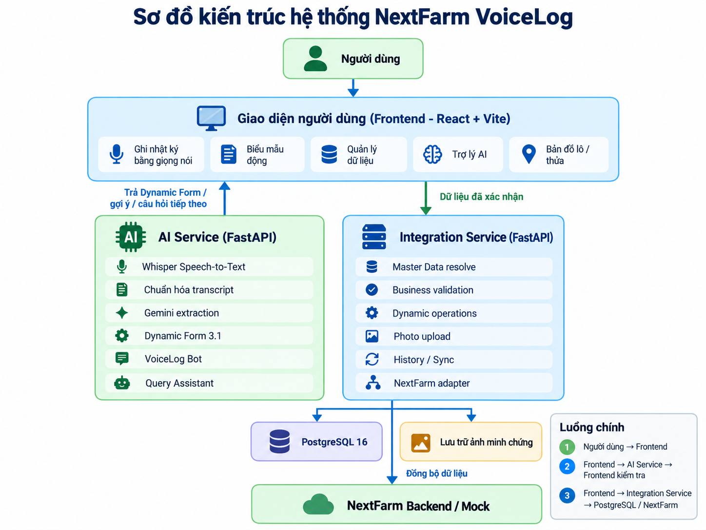

# NextFarm VoiceLog

Hệ thống hỗ trợ ghi và quản lý nhật ký sản xuất nông nghiệp bằng giọng nói tiếng Việt cho NextFarm.

NextFarm VoiceLog cho phép người dùng ghi âm hoặc nhập tay, chuyển giọng nói thành văn bản, trích xuất dữ liệu bằng AI, hỏi bổ sung khi còn thiếu thông tin, kiểm tra lại trước khi xác nhận và lưu dữ liệu qua dịch vụ tích hợp.

## Tính năng chính

- Ghi nhật ký bằng giọng nói tiếng Việt hoặc nhập tay.
- Chuyển giọng nói thành văn bản bằng Whisper và chuẩn hóa một số lỗi nhận dạng theo ngữ cảnh nông nghiệp.
- Trích xuất dữ liệu theo Dynamic Form 3.1 (biểu mẫu động phiên bản 3.1).
- Hỏi bổ sung khi thiếu trường bắt buộc và hỗ trợ câu trả lời ngắn theo ngữ cảnh.
- Cho phép sửa nội dung đã nhận dạng và phân tích lại trước khi xác nhận.
- Hỗ trợ tạo và quản lý loại cây trồng, lô canh tác, mùa vụ, công việc, nhật ký, sự cố và thu hoạch.
- Hỗ trợ bản đồ lô/thửa và tải ảnh minh chứng cho các nghiệp vụ cần ảnh.
- Có AI Assistant (trợ lý AI) và Query Assistant (trợ lý truy vấn) để hỗ trợ thao tác và tra cứu dữ liệu.

## Giao diện hệ thống

### Ghi nhật ký bằng giọng nói

Người dùng có thể ghi âm hoặc nhập nội dung, sau đó kiểm tra phần văn bản và biểu mẫu được hệ thống trích xuất trước khi xác nhận.



### Trợ lý AI và biểu mẫu động

Trên màn hình lớn, trợ lý AI được bố trí ở vùng bên phải để không che bản đồ hoặc biểu mẫu dài.



### Quản lý và tra cứu dữ liệu

Người dùng có thể xem lại dữ liệu đã lưu và sử dụng trợ lý để tra cứu nhanh ngay trên màn hình quản lý.



## Kiến trúc hệ thống

Sơ đồ dưới đây thể hiện luồng chính từ người dùng qua giao diện, dịch vụ AI, dịch vụ tích hợp, cơ sở dữ liệu và hệ thống NextFarm.



Ba thành phần chính có trách nhiệm tách biệt:

| Thành phần | Trách nhiệm chính |
|---|---|
| Frontend (giao diện người dùng) | Ghi âm, hiển thị nội dung, biểu mẫu, bản đồ, quản lý dữ liệu và trợ lý |
| AI Service (dịch vụ AI) | Xử lý âm thanh, chuyển giọng nói thành văn bản, chuẩn hóa, trích xuất dữ liệu và hội thoại bổ sung |
| Integration Service (dịch vụ tích hợp) | Ánh xạ dữ liệu chuẩn, kiểm tra nghiệp vụ, lưu dữ liệu, tải ảnh, lịch sử và đồng bộ NextFarm |

AI Service không tự tạo mã nghiệp vụ hoặc mã dữ liệu chuẩn khi chưa có căn cứ. Dữ liệu quan trọng được đưa về cho người dùng kiểm tra trước khi Integration Service lưu.

## Nghiệp vụ hỗ trợ

| Mã nghiệp vụ | Chức năng |
|---|---|
| `CREATE_WORK_LOG` | Tạo nhật ký công việc/canh tác |
| `CREATE_CROP_TYPE` | Tạo loại cây trồng |
| `CREATE_PLOT` | Tạo lô/thửa đất |
| `CREATE_SEASON` | Tạo mùa vụ |
| `CREATE_TASK` | Tạo công việc |
| `CREATE_HARVEST` | Tạo bản ghi thu hoạch |
| `CREATE_ISSUE_REPORT` | Ghi nhận sự cố |

Các nghiệp vụ sử dụng cùng cơ chế biểu mẫu động: trích xuất dữ liệu, phát hiện trường còn thiếu, hỏi bổ sung khi cần và chờ người dùng xác nhận trước khi lưu.

## Nguyên tắc xử lý dữ liệu

- Không tự tạo mã nghiệp vụ, mã cơ sở dữ liệu hoặc mã dữ liệu chuẩn.
- Câu trả lời ngắn được áp dụng vào trường đang chờ khi ngữ cảnh đủ rõ.
- Nội dung giọng nói có thể được chỉnh sửa và phân tích lại trước khi xác nhận.
- Các giá trị mơ hồ như đơn vị địa phương không được tự quy đổi nếu chưa có quy tắc rõ ràng.
- Những nghiệp vụ yêu cầu ảnh có thể tải ảnh minh chứng trước khi lưu.

## Công nghệ

| Thành phần | Công nghệ chính |
|---|---|
| Giao diện | React 19, Vite 8, Leaflet |
| Dịch vụ AI | FastAPI, Whisper, Gemini, Pydantic |
| Dịch vụ tích hợp | FastAPI, SQLAlchemy 2, Alembic |
| Cơ sở dữ liệu | PostgreSQL 16, Psycopg 3 |
| Kiểm thử | pytest, Vitest, Testing Library |
| Môi trường | Docker Compose |

## Cấu trúc dự án

```text
nextfarm-voicelog/
|-- frontend/                 # giao diện người dùng
|-- ai-service/               # xử lý giọng nói và AI
|-- integration-service/      # nghiệp vụ, lưu dữ liệu và đồng bộ
|-- contracts/                # hợp đồng dữ liệu
|-- docs/                     # tài liệu và ảnh minh họa
|-- postman/                  # bộ yêu cầu kiểm thử API
|-- scripts/                  # script hỗ trợ
|-- docker-compose.yml
|-- CONTRIBUTING.md
|-- README.md
`-- .gitignore
```

## Khởi chạy nhanh

### 1. PostgreSQL

Từ thư mục gốc:

```powershell
docker compose up -d postgres
docker ps
```

### 2. AI Service

```powershell
cd ai-service
.\.venv\Scripts\Activate.ps1
python -m uvicorn app.main:app --port 8000
```

Không nên dùng `--reload` trên máy ít RAM vì Whisper có thể được nạp nhiều lần.

### 3. Integration Service

Mở cửa sổ lệnh mới:

```powershell
cd integration-service
.\.venv\Scripts\Activate.ps1
python -m uvicorn app.main:app --port 8002
```

### 4. Frontend

Mở cửa sổ lệnh mới:

```powershell
cd frontend
npm install
npm run dev
```

Nếu thư viện đã được cài, chỉ cần chạy:

```powershell
npm run dev
```

## Cổng dịch vụ

| Dịch vụ | Địa chỉ |
|---|---|
| Frontend | `http://localhost:5173` |
| AI Service | `http://127.0.0.1:8000` |
| AI Swagger | `http://127.0.0.1:8000/docs` |
| Integration Service | `http://127.0.0.1:8002` |
| Integration Swagger | `http://127.0.0.1:8002/docs` |
| PostgreSQL host port | `1275` |

## Cấu hình

Không đưa tệp `.env` hoặc khóa thật lên Git.

Integration Service có thể cấu hình danh sách khu vực cho nghiệp vụ tạo lô bằng biến:

```env
NEXTFARM_REGIONS_JSON=[{"region_id":"region-hanoi","name":"Hà Nội","aliases":["Ha Noi","Hanoi"]}]
```

`region_id` phải khớp mã khu vực thực tế của môi trường NextFarm. Sau khi thay đổi cấu hình, cần khởi động lại dịch vụ để nạp lại biến môi trường.

Các cấu hình khác xem trong tệp `.env.example` của từng dịch vụ.

## Kiểm thử

### Frontend

```powershell
cd frontend
npm run lint
npm run build
npx vitest run
```

Một số tệp kiểm thử JavaScript cũ chạy trực tiếp bằng `node` và không khai báo bộ kiểm thử theo chuẩn Vitest; vì vậy khi chạy toàn bộ có thể xuất hiện thông báo `No test suite found` cho các tệp cũ này.

### AI Service

```powershell
cd ai-service
.\.venv\Scripts\Activate.ps1
python -m pytest tests
```

### Integration Service

```powershell
cd integration-service
.\.venv\Scripts\Activate.ps1
python -m pytest tests
```

## Tài liệu chi tiết

- `ai-service/README.md`: xử lý giọng nói, trích xuất dữ liệu và biểu mẫu động.
- `integration-service/README.md`: dữ liệu chuẩn, kiểm tra nghiệp vụ, lưu dữ liệu, ảnh và đồng bộ.
- `.env.example` của từng dịch vụ: cấu hình môi trường.
- Swagger của từng dịch vụ: danh sách điểm truy cập và cấu trúc dữ liệu hiện hành.

## Thành viên

| Thành viên | Phụ trách |
|---|---|
| Hiệp | Integration Service, NextFarm API, Master Data, lưu và đồng bộ dữ liệu |
| Thắng | Backend AI / AI Service: FastAPI, Whisper, Gemini, Validation, VoiceLog Bot |
| Khoa | Frontend React/Vite, giao diện VoiceLog và AI Assistant |

## Bảo mật

Không đưa thông tin bí mật lên kho mã, bao gồm:

```text
.env
API keys
Gemini API key
Database credentials
Private tokens
```

Chỉ đưa các tệp cấu hình mẫu không chứa giá trị thật lên kho mã.

## Phạm vi sử dụng

Dự án được xây dựng phục vụ quá trình phát triển và thực tập với hệ thống NextFarm.
