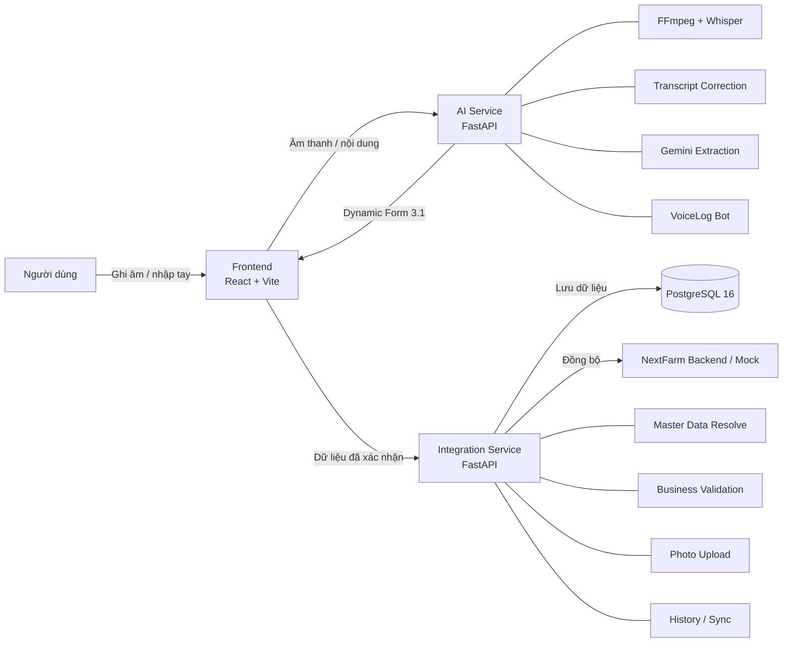

# NextFarm VoiceLog

Hệ thống ghi nhật ký sản xuất nông nghiệp bằng giọng nói tiếng Việt cho NextFarm.

## Tổng quan

NextFarm VoiceLog cho phép người dùng tạo và quản lý dữ liệu sản xuất nông nghiệp bằng giọng nói hoặc nhập tay. Hệ thống xử lý âm thanh, chuyển giọng nói thành văn bản, chuẩn hóa nội dung, trích xuất dữ liệu bằng AI, hỏi bổ sung khi thiếu thông tin, cho phép người dùng xác nhận và lưu dữ liệu qua dịch vụ tích hợp.

Hệ thống hiện gồm ba phần chính:

- Frontend (giao diện người dùng): React + Vite.
- AI Service (dịch vụ AI): FastAPI, Whisper và Gemini.
- Integration Service (dịch vụ tích hợp): FastAPI, SQLAlchemy và PostgreSQL.

Ngoài luồng nhập nhật ký, hệ thống còn có Query Assistant (trợ lý truy vấn) để tra cứu dữ liệu bằng ngôn ngữ tự nhiên và AI Assistant (trợ lý AI) hỗ trợ thao tác trực tiếp trên giao diện.

## Giao diện hệ thống

### Ghi nhật ký bằng giọng nói

Người dùng có thể ghi âm hoặc nhập nội dung, sau đó hệ thống chuyển giọng nói thành văn bản, trích xuất dữ liệu và hiển thị biểu mẫu để kiểm tra trước khi xác nhận.


### Trợ lý AI và biểu mẫu động

Trên màn hình lớn, AI Assistant (trợ lý AI) được bố trí ở vùng bên phải để hỗ trợ người dùng mà không che bản đồ hoặc biểu mẫu dài.


### Quản lý và tra cứu dữ liệu

Người dùng có thể xem lại các loại cây trồng, lô canh tác, mùa vụ, công việc, sự cố và thu hoạch đã lưu. Trợ lý AI cũng có thể hỗ trợ tra cứu nhanh dữ liệu ngay trên màn hình quản lý.


## Kiến trúc

Sơ đồ kiến trúc tổng quát:



Luồng xử lý chính:

```text
Người dùng
  -> Frontend
  -> AI Service
  -> kiểm tra / xác nhận
  -> Integration Service
  -> PostgreSQL
  -> NextFarm Backend / Mock
```

LLM (mô hình ngôn ngữ lớn) không được phép tự tạo mã nghiệp vụ tùy ý. AI Service ưu tiên trả dữ liệu dạng người dùng có thể đọc và xác nhận; Integration Service chịu trách nhiệm chuẩn hóa, ánh xạ Master Data (dữ liệu chuẩn), kiểm tra nghiệp vụ và lưu dữ liệu.

## Nghiệp vụ hiện hỗ trợ

| Mã nghiệp vụ | Chức năng |
|---|---|
| `CREATE_WORK_LOG` | Tạo nhật ký công việc/canh tác |
| `CREATE_CROP_TYPE` | Tạo loại cây trồng |
| `CREATE_PLOT` | Tạo lô/thửa đất |
| `CREATE_SEASON` | Tạo mùa vụ |
| `CREATE_TASK` | Tạo công việc |
| `CREATE_HARVEST` | Tạo bản ghi thu hoạch |
| `CREATE_ISSUE_REPORT` | Ghi nhận sự cố |

Các nghiệp vụ dùng cùng cơ chế Dynamic Form (biểu mẫu động): AI trích xuất dữ liệu, chỉ ra trường còn thiếu, hỏi bổ sung nếu cần và chờ người dùng xác nhận trước khi lưu.

## Dynamic Form Contract 3.1

Cấu trúc phản hồi chung của biểu mẫu động:

```json
{
  "contract_version": "3.1",
  "operation": "CREATE_WORK_LOG",
  "fields": {},
  "missing_fields": [],
  "warnings": [],
  "field_confidence": {},
  "requires_confirmation": false,
  "next_question": null
}
```

`fields` thay đổi theo từng nghiệp vụ.

Một số nguyên tắc quan trọng:

- Không tự tạo mã nghiệp vụ khi chưa có dữ liệu chuẩn tương ứng.
- Câu trả lời ngắn được áp dụng vào đúng trường đang chờ khi ngữ cảnh đủ rõ ràng.
- Nội dung nhập tay có thể được sửa và bấm **Phân tích lại** để cập nhật biểu mẫu.
- Transcript Correction (chuẩn hóa nội dung chuyển giọng nói thành chữ) chỉ sửa các lỗi đủ đặc hiệu theo ngữ cảnh, ví dụ `cà chua pi` → `cà chua bi`.
- Các cụm sự cố cụ thể như `bệnh đốm lá` được chuẩn hóa về nhóm nghiệp vụ `Bệnh`; cụm mơ hồ như `sâu bệnh` không được tự chọn một nhóm.

## Công nghệ

| Thành phần | Công nghệ |
|---|---|
| Frontend | React 19, Vite 8, Leaflet |
| AI Service | FastAPI, Uvicorn, Pydantic |
| Speech-to-Text (chuyển giọng nói thành văn bản) | OpenAI Whisper |
| LLM | Google Gemini (`google-genai`) |
| Integration Service | FastAPI, SQLAlchemy 2 |
| Database (cơ sở dữ liệu) | PostgreSQL 16 |
| PostgreSQL Driver (trình điều khiển PostgreSQL) | Psycopg 3 |
| Migration (quản lý thay đổi cơ sở dữ liệu) | Alembic |
| Testing (kiểm thử) | pytest, Vitest, Testing Library |
| Container (môi trường đóng gói) | Docker Compose |
| API Testing (kiểm thử API) | Postman |

## Cấu trúc repository

```text
nextfarm-voicelog/
|-- frontend/
|   |-- public/
|   |-- src/
|   |-- package.json
|   `-- vite.config.js
|-- ai-service/
|   |-- app/
|   |-- benchmark/
|   |-- tests/
|   |-- uploads/
|   |-- Dockerfile
|   `-- requirements.txt
|-- integration-service/
|   |-- app/
|   |-- migrations/
|   |-- tests/
|   |-- uploads/
|   |-- alembic.ini
|   `-- requirements.txt
|-- contracts/
|-- docs/
|-- postman/
|-- scripts/
|-- docker-compose.yml
|-- CONTRIBUTING.md
|-- README.md
`-- .gitignore
```

## Thành viên

| Thành viên | Phụ trách |
|---|---|
| Hiệp | Integration Service, NextFarm API, Master Data, lưu và đồng bộ dữ liệu |
| Thắng | Backend AI / AI Service: FastAPI, Whisper, Gemini, Validation, VoiceLog Bot |
| Khoa | Frontend React/Vite, giao diện VoiceLog và AI Assistant |

## Cổng dịch vụ

| Dịch vụ | Địa chỉ |
|---|---|
| Frontend | `http://localhost:5173` |
| AI Service | `http://127.0.0.1:8000` |
| AI Swagger | `http://127.0.0.1:8000/docs` |
| Integration Service | `http://127.0.0.1:8002` |
| Integration Swagger | `http://127.0.0.1:8002/docs` |
| PostgreSQL host port | `1275` |

## Cấu hình môi trường

Không đưa `.env` hoặc khóa thật lên Git.

Integration Service có thể dùng biến cấu hình khu vực chuẩn cho nghiệp vụ tạo lô:

```env
NEXTFARM_REGIONS_JSON=[{"region_id":"region-hanoi","name":"Hà Nội","aliases":["Ha Noi","Hanoi"]}]
```

`region_id` phải khớp mã khu vực thực tế của môi trường NextFarm. Sau khi sửa `.env`, cần khởi động lại Integration Service để nạp lại biến môi trường.

Các cấu hình chi tiết khác xem trong `.env.example` của từng dịch vụ.

## Chạy hệ thống

### 1. PostgreSQL

Từ thư mục gốc:

```powershell
docker compose up -d postgres
docker ps
```

### 2. AI Service

```powershell
cd ai-service
.\.venv\Scripts\Activate.ps1
python -m uvicorn app.main:app --port 8000
```

Không nên dùng `--reload` trên máy ít RAM vì Whisper có thể được nạp nhiều lần.

### 3. Integration Service

Mở cửa sổ lệnh mới:

```powershell
cd integration-service
.\.venv\Scripts\Activate.ps1
python -m uvicorn app.main:app --port 8002
```

### 4. Frontend

Mở cửa sổ lệnh mới:

```powershell
cd frontend
npm install
npm run dev
```

Nếu thư viện đã được cài:

```powershell
npm run dev
```

## AI Service API

Các endpoint (điểm truy cập API) chính:

```text
POST /api/v1/audio/upload
POST /api/v1/dynamic-form/extract
POST /api/v1/bot/sessions
GET  /api/v1/bot/sessions/{session_id}
POST /api/v1/bot/sessions/{session_id}/messages
GET  /api/v1/health
GET  /api/v1/ready
```

## Integration Service API

Các nhóm API chính:

```text
/api/cultivation-logs
/api/crop-types
/api/plots
/api/seasons
/api/tasks
/api/harvests
/api/issue-reports
/api/uploads/images
/api/master-data
/api/history
/api/nextfarm
/api/sync
/health
```

Danh sách endpoint đầy đủ và schema hiện tại xem trực tiếp tại:

```text
http://127.0.0.1:8002/docs
```

## Master Data

Một số nhóm dữ liệu chuẩn hiện dùng gồm:

- hoạt động;
- lô/thửa;
- vật tư;
- đơn vị;
- cây trồng;
- mùa vụ;
- khu vực.

Ví dụ:

```text
Cho bò ăn -> CHO_BO_AN
Lô A       -> LO_A
Cám        -> CAM
kg         -> KG
```

Các giá trị mơ hồ theo vùng miền như `xị`, `công`, `sào` không được tự động quy đổi nếu chưa có quy tắc nghiệp vụ rõ ràng.

## Ảnh minh chứng

Integration Service hỗ trợ tải ảnh tại:

```text
POST /api/uploads/images
```

Định dạng ảnh hỗ trợ:

```text
JPEG
PNG
WEBP
```

Kích thước tối đa hiện tại: 10 MB mỗi ảnh.

Giao diện đã hỗ trợ chọn và tải ảnh cho các nghiệp vụ cần ảnh như sự cố và thu hoạch; cảnh báo cũ về việc chưa hỗ trợ tải ảnh không còn được sử dụng.

## Chỉnh sửa nội dung và phân tích lại

Sau khi hệ thống chuyển giọng nói thành chữ, người dùng có thể sửa nội dung trực tiếp.

Khi transcript bị thay đổi:

```text
Sửa nội dung
 -> biểu mẫu được đánh dấu chưa đồng bộ
 -> bấm "Phân tích lại"
 -> AI Service phân tích nội dung mới
 -> Dynamic Form được cập nhật
 -> người dùng kiểm tra và xác nhận
```

Hệ thống không âm thầm ghi đè biểu mẫu ngay khi người dùng đang sửa nội dung.

## AI Assistant trên màn hình lớn

Khi màn hình đủ rộng và AI Assistant được mở, giao diện dành một vùng bên phải cho trợ lý thay vì để cửa sổ trợ lý che bản đồ hoặc biểu mẫu dài.

Ở kích thước màn hình nhỏ hơn, giao diện vẫn sử dụng bố cục thích ứng.

## Query Assistant

Ví dụ câu hỏi hỗ trợ:

```text
Cho tôi xem nhật ký gần nhất
Hôm nay có những hoạt động gì?
Cho tôi xem nhật ký hôm qua
7 ngày gần đây có những hoạt động gì?
Có bao nhiêu lần bón phân?
Lô A đã bón phân bao nhiêu lần?
NPK đã được dùng ở lô nào?
```

Các truy vấn ngày được xử lý theo thời gian Việt Nam UTC+7.

Intent Router (bộ định tuyến ý định) ưu tiên nhận diện câu hỏi tra cứu để Query Assistant không bị VoiceLog Bot hiểu nhầm thành giá trị của trường đang thiếu.

## Kiểm thử

### Frontend

Kiểm tra quy tắc mã và đóng gói:

```powershell
cd frontend
npm run lint
npm run build
```

Chạy các bộ kiểm thử Vitest:

```powershell
npx vitest run
```

Lưu ý: một số tệp kiểm thử JavaScript cũ chạy kiểm tra trực tiếp bằng `node` và không khai báo `describe/it` theo chuẩn Vitest, nên khi chạy toàn bộ `npx vitest run` có thể xuất hiện thông báo `No test suite found` cho các tệp cũ đó.

Các kiểm thử giao diện mục tiêu của đợt tích hợp hiện tại đã đạt 11/11, gồm kiểm thử chỉnh sửa nhật ký, bản đồ, tải ảnh, phân tích lại transcript và bố cục AI Assistant.

### AI Service

```powershell
cd ai-service
.\.venv\Scripts\Activate.ps1
python -m pytest tests
```

Mốc kiểm thử gần nhất trên nhánh tích hợp: **55/55 đạt**.

Không dùng `python -m pytest` tại thư mục gốc nếu chỉ muốn chạy bộ kiểm thử chính thức, vì tệp thử nghiệm thủ công `test_whisper.py` ở ngoài thư mục `tests` phụ thuộc vào một tệp âm thanh cục bộ cụ thể.

### Integration Service

```powershell
cd integration-service
.\.venv\Scripts\Activate.ps1
python -m pytest tests
```

Mốc kiểm thử gần nhất trên nhánh tích hợp: **304/304 đạt**.

## Demo checklist

```text
[ ] PostgreSQL đang chạy
[ ] AI Service chạy ở port 8000
[ ] Integration Service chạy ở port 8002
[ ] Frontend chạy ở port 5173
[ ] AI Swagger truy cập được
[ ] Integration Swagger truy cập được
[ ] Ghi âm -> transcript -> Dynamic Form hoạt động
[ ] Sửa transcript -> Phân tích lại hoạt động
[ ] VoiceLog Bot hỏi bổ sung đúng trường còn thiếu
[ ] CREATE_WORK_LOG lưu được
[ ] CREATE_CROP_TYPE lưu được
[ ] CREATE_PLOT ánh xạ khu vực đúng
[ ] CREATE_SEASON lưu được
[ ] CREATE_TASK lưu được
[ ] CREATE_HARVEST lưu được và tải ảnh được khi cần
[ ] CREATE_ISSUE_REPORT chuẩn hóa loại sự cố và tải ảnh được
[ ] AI Assistant không che bản đồ/biểu mẫu trên màn hình lớn
[ ] Query Assistant hoạt động
```

Luồng chính:

```text
Audio / Text
 -> FFmpeg + Whisper (nếu có audio)
 -> Transcript Correction
 -> Gemini Extraction
 -> Dynamic Form 3.1
 -> Confidence / Missing Fields
 -> VoiceLog Bot hỏi bổ sung nếu cần
 -> User Review / Manual Edit
 -> Re-analyze nếu transcript được sửa
 -> User Confirmation
 -> Integration Service
 -> Master Data Resolve
 -> Business Validation
 -> Photo Upload nếu có
 -> PostgreSQL
 -> NextFarm Adapter / Mock
```

## Git workflow

Luồng phát triển chung:

```text
feature/* hoặc task/*
        |
        v
Pull Request
        |
        v
develop
        |
        v
Regression Test
        |
        v
main
```

Nhánh `integration/v3-full-system-check` hiện được dùng để kiểm tra tích hợp toàn hệ thống trước khi đưa thay đổi về luồng chính của nhóm.

Quy ước:

- `main`: phiên bản ổn định.
- `develop`: nhánh tích hợp chung.
- `feature/*`, `task/*`: nhánh phát triển chức năng.
- `integration/v3-full-system-check`: nhánh kiểm tra tích hợp V3 hiện tại.
- Không ghi thay đổi trực tiếp vào `main` nếu chưa qua quy trình của nhóm.

## Bảo mật

Không đưa các thông tin bí mật lên Git:

```text
.env
API keys
Gemini API key
Database credentials
Private tokens
```

Chỉ đưa `.env.example` không chứa giá trị thật vào kho mã.

## Trạng thái chức năng

Hệ thống hiện đã có:

```text
Audio Processing
Whisper Speech-to-Text
Safe Transcript Correction
Gemini Extraction
Dynamic Form 3.1
Confidence / Uncertainty
Missing Fields Detection
VoiceLog Bot
Manual Transcript Re-analysis
Intent Router
Query Assistant
Master Data Resolution
CREATE_WORK_LOG
CREATE_CROP_TYPE
CREATE_PLOT
CREATE_SEASON
CREATE_TASK
CREATE_HARVEST
CREATE_ISSUE_REPORT
Photo Upload
AI Assistant Desktop Side Rail
PostgreSQL Persistence
Integration History
NextFarm Mock / Adapter
Regression Tests
```

## License

Private project for NextFarm Internship.
